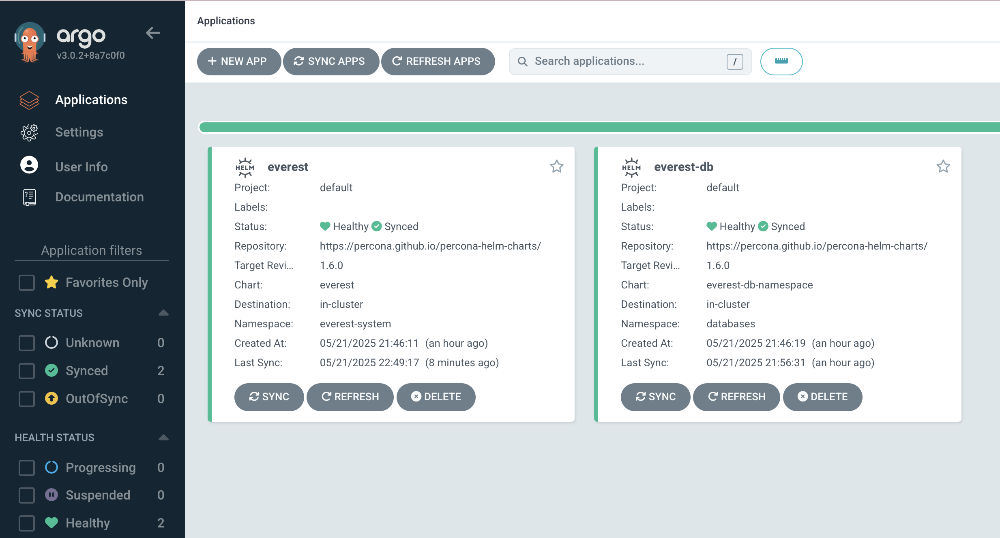
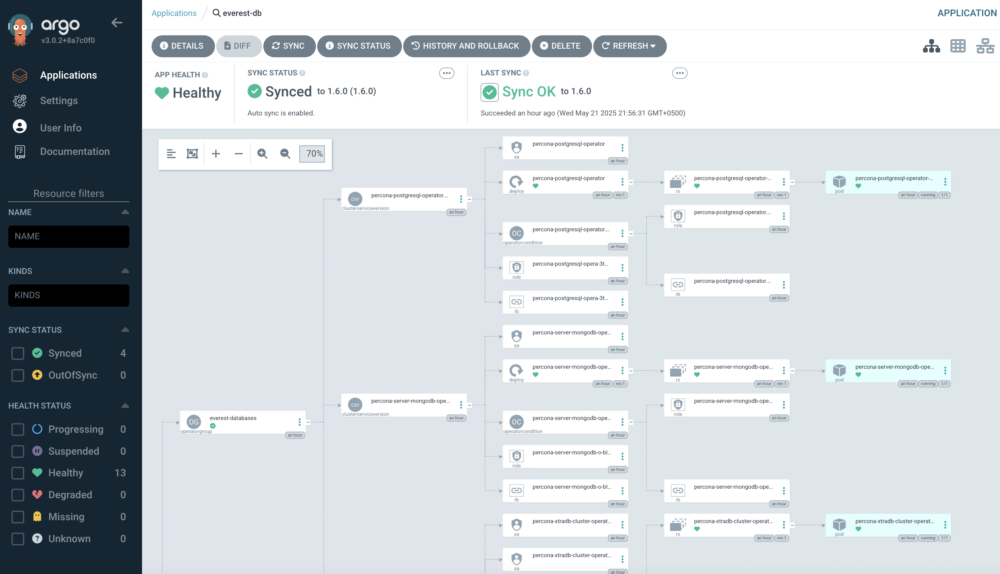
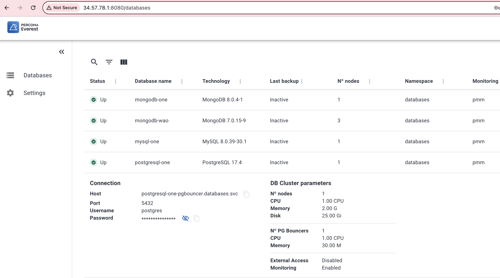
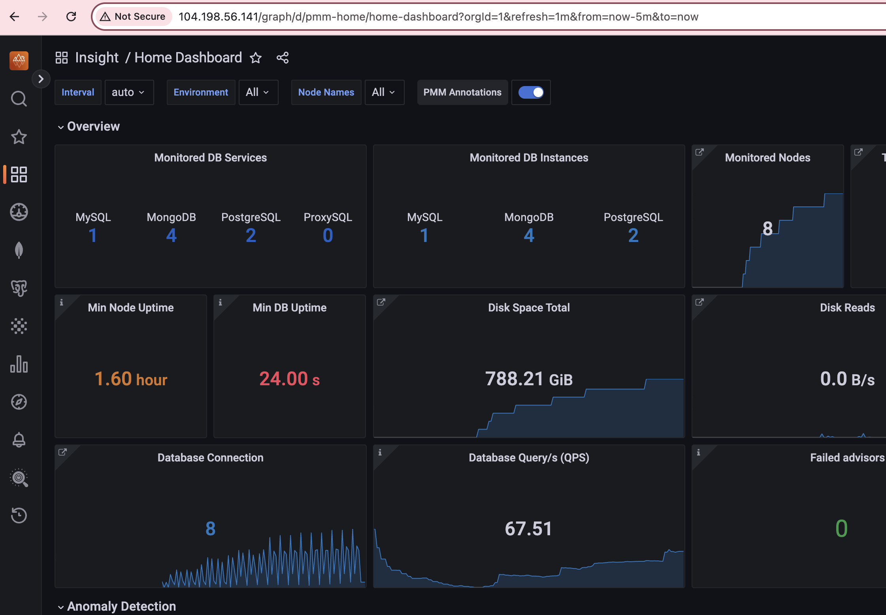

# Percona Everest GitOps Deployment with Argo CD

This repository demonstrates how to deploy [Percona Everest](https://www.percona.com/software/percona-everest) using a GitOps approach with [Argo CD](https://argoproj.github.io/cd/). Percona Everest simplifies the deployment and management of Percona database distributions (MongoDB, PostgreSQL, MySQL) on Kubernetes, along with integrated Percona Monitoring and Management (PMM).

-----

## 1\. Prerequisites

Before you begin, ensure you have:

  * A running Kubernetes cluster (e.g., Minikube, Kind, GKE, EKS, AKS).
  * `kubectl` configured to connect to your cluster.
  * **Argo CD installed and configured** in your Kubernetes cluster. If not, refer to the [Argo CD Installation Guide](#argo-cd-installation-guide) at the end of this README.

-----

## 2\. Deploy Percona Everest Applications

This repository contains Argo CD `Application` manifests that define how Percona Everest and its database operators should be deployed.

  * The `apps/everest.yaml` defines the core Everest UI and PMM integration.
  * The `apps/everest-db.yaml` defines the Percona Database Operators. It's configured to automatically approve OLM `InstallPlans` for the MongoDB, PostgreSQL, and XtraDB Cluster operators, ensuring a seamless deployment.


1.  **Deploy the Everest Core Application:**

    ```bash
    kubectl apply -f apps/everest.yaml -n argocd
    ```

2.  **Deploy the Everest Database Operators Application:**

    ```bash
    kubectl apply -f apps/everest-db.yaml -n argocd
    ```

3.  **Monitor Deployment Status:**

    Argo CD will now start syncing these applications. You can monitor their status using the Argo CD CLI:

    ```bash
    argocd app list
    argocd app get everest
    argocd app get everest-db
    ```

    Wait until both applications show **`STATUS Synced`** and **`HEALTH Healthy`**. This might take a few minutes as Kubernetes resources are provisioned and operators start.

    Here's an overview of the deployed applications in Argo CD:

    

    _Fig 1: Argo CD Applications Dashboard showing Everest and Everest-DB are Healthy and Synced._

    A detailed view of the Everest-DB application within Argo CD, illustrating the deployed operators:

    

    _Fig 2: Detailed view of the Everest-DB application in Argo CD, showing the deployed Percona database operators._

4.  **Verify Operator Pods:**

    You can check the deployed operator pods in the `databases` namespace:

    ```bash
    kubectl get pods -n databases
    kubectl get csv -n databases
    ```

    You should see the operator pods running and their ClusterServiceVersions (CSVs) in a **`Succeeded`** phase.

-----

## 3\. Access Percona Everest UI and PMM

Once the applications are **`Healthy`**, you can access the Everest and PMM UIs.

By default, the `everest.yaml` configures the Everest and PMM services to use **`LoadBalancer`** type. This means your cloud provider will attempt to provision external IP addresses for these services.

If you are running on a local cluster (like Minikube/Kind) or if your cloud provider doesn't support `LoadBalancer` services, you might not get an external IP. In such cases, or if you prefer to access them without an external IP, you can change the service type to **`ClusterIP`** in `apps/everest.yaml` and use `kubectl port-forward`.

To change the service type:
Edit `apps/everest.yaml` and modify these lines under `helm.parameters`:

```yaml
      - name: server.service.type
        value: "ClusterIP" # Change from "LoadBalancer"
      # ...
      - name: pmm.service.type
        value: "ClusterIP" # Change from "LoadBalancer"
```

After modifying the file, run `kubectl apply -f apps/everest.yaml -n argocd` again.

-----

1.  **Get Everest UI Admin Password:**

    ```bash
    kubectl get secret everest-accounts -n everest-system -o jsonpath='{.data.SUPERUSER_PASSWORD}' | base64 --decode
    ```

2.  **Get PMM Admin Password:**

    ```bash
    kubectl get secret pmm-secret -n everest-system -o jsonpath='{.data.PMM_ADMIN_PASSWORD}' | base64 --decode
    ```

3.  **Access UIs:**

      * **If using `LoadBalancer` (default):**

        ```bash
        kubectl get svc -n everest-system
        ```

        Look for the **`everest`** and **`pmm`** services. If they show an **`EXTERNAL-IP`**, use that to access the UIs in your browser.

          * **For Everest UI:** Navigate to `https://<EXTERNAL-IP_OF_EVEREST_SVC>:8080`
          * **For PMM UI:** Navigate to `http://<EXTERNAL-IP_OF_PMM_SVC>` (PMM typically uses port 80/443 for UI)

      * **If using `ClusterIP` (or for local access):**
        Use `kubectl port-forward` to temporarily expose the services to your local machine.

        ```bash
        # For Everest UI (adjust ports if necessary)
        kubectl port-forward svc/everest -n everest-system 8080:8080

        # For PMM UI (adjust ports if necessary)
        kubectl port-forward svc/pmm -n everest-system 8081:80
        ```

        Then, navigate to `https://localhost:8080` for Everest and `http://localhost:8081` for PMM in your browser.

    Here's an example of the Percona Everest UI dashboard showing deployed databases:

    

    *Fig 3: Percona Everest UI displaying a list of managed database clusters.*

    And here's a view of the PMM dashboard integrated with Everest:

    
    *Fig 4: Percona Monitoring and Management (PMM) dashboard providing insights into monitored database services and instances.*

You're now ready to log into the Percona Everest UI (username `admin`, password retrieved from `everest-accounts` secret) and begin deploying and managing your database clusters\!

-----

## Argo CD Installation Guide

If Argo CD is not yet installed in your Kubernetes cluster, follow these detailed steps.

1.  **Create the Argo CD Namespace:**

    ```bash
    kubectl create namespace argocd
    ```

2.  **Install Argo CD Manifests:**

    ```bash
    kubectl apply -n argocd -f https://raw.githubusercontent.com/argoproj/argo-cd/stable/manifests/install.yaml
    ```

    This will deploy all Argo CD components into the `argocd` namespace.

3.  **Wait for Argo CD Pods to be Ready:**

    ```bash
    kubectl get pods -n argocd
    ```

    Wait until all pods show **`READY 1/1`** and **`STATUS Running`**.

4.  **Download the Argo CD CLI:**

    ```bash
    # For macOS
    brew install argocd

    # For Linux (adjust version as needed)
    curl -sSL -o argocd-linux-amd64 https://github.com/argoproj/argo-cd/releases/latest/download/argocd-linux-amd64
    sudo install -m 555 argocd-linux-amd64 /usr/local/bin/argocd
    rm argocd-linux-amd64
    ```

5.  **Get the Initial Admin Password:**

    ```bash
    argocd admin initial-password -n argocd
    # Example output: aBcHjK12XyZ
    ```

    **Save this password.** This password is only for the first login.

6.  **Access Argo CD UI for Initial Login:**

    To access the Argo CD web UI for the first time, you'll need its IP address and the initial admin password.

      * **Port-Forward (recommended for local setup):**

        ```bash
        kubectl port-forward svc/argocd-server -n argocd 8080:443
        ```

        Then, open your browser to `https://localhost:8080`.

      * **Get External IP (if using LoadBalancer/NodePort):**

        ```bash
        kubectl get svc argocd-server -n argocd
        ```

        Look for the `EXTERNAL-IP` or `NODEPORT`.

    Log in to the Argo CD UI with username **`admin`** and the password you retrieved from `argocd admin initial-password`.

7.  **Log in to Argo CD CLI:**

    ```bash
    argocd login localhost:8080 --insecure
    # Username: admin
    # Password: <paste_your_initial_password>
    ```

8.  **Update Admin Password (Highly Recommended):**

    ```bash
    argocd account update-password
    # Follow the prompts to set a new, strong password.
    ```

9.  **Delete Initial Admin Secret (Recommended for enhanced security):**

    ```bash
    kubectl delete secret argocd-initial-admin-secret -n argocd
    ```

10. **Configure Argo CD RBAC:**

    For the `admin` user to manage applications within the Argo CD UI or CLI after the initial setup, you'll need to ensure it has the necessary permissions. This repository includes an `argocd-rbac.yaml` file to grant full admin access.

    ```bash
    kubectl apply -f argocd-rbac.yaml -n argocd
    ```

    **Note:** After applying RBAC changes, it's a good practice to re-login to the Argo CD CLI to ensure your session picks up the new permissions.

    ```bash
    argocd logout localhost:8080
    argocd login localhost:8080 --insecure
    # Username: admin
    # Password: <your_new_password>
    ```